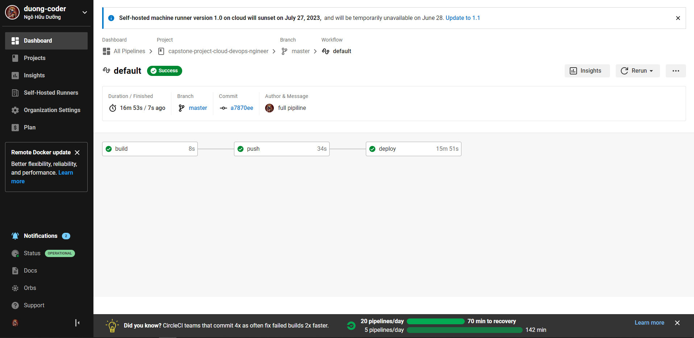
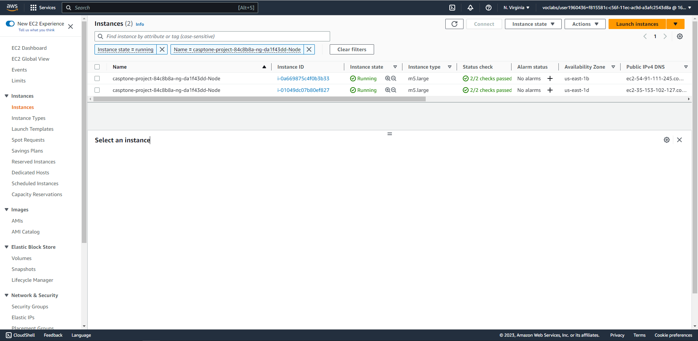
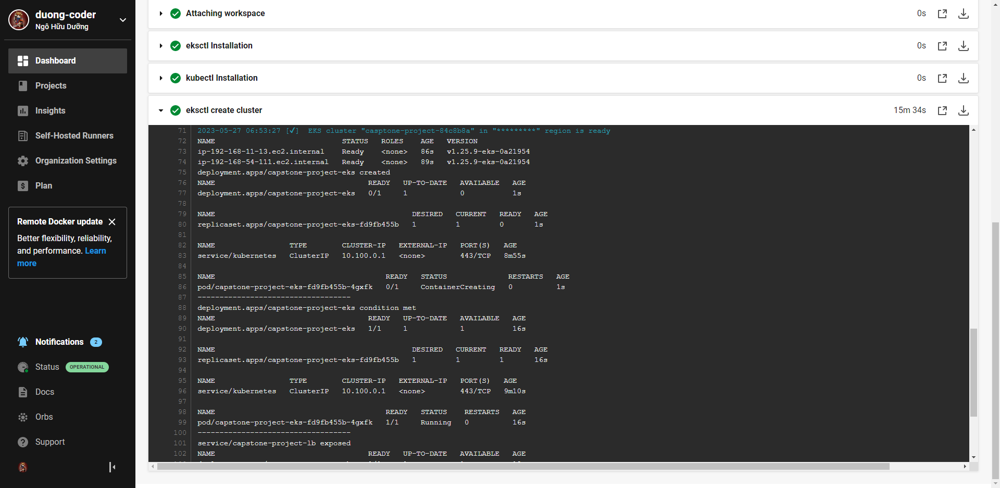
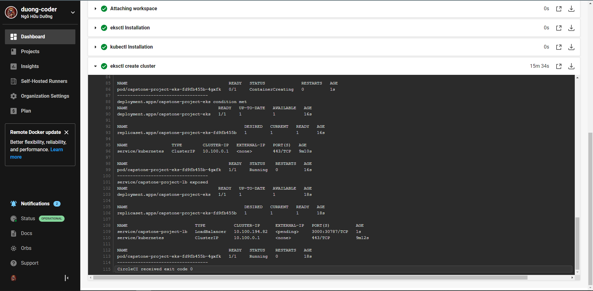
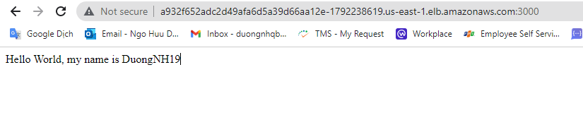

# Url app
http://a932f652adc2d49afa6d5a39d66aa12e-1792238619.us-east-1.elb.amazonaws.com:3000/

# Propose and Scope the Project
1. My pipeline
    | Build --> Push --> Deploy
2. Use Circle CI for Continuous Integration phase.
3. Deployment type: blue/green deployment.
4. Application: nodejs sample application

# Pick AWS Kubernetes as a Service.
1. ```eksctl``` 
2. ```kubectl``` 

# Build pipeline
1. Steps in CircileCI: 
    - build: Build app and lint Dockerfile
    - push: Build and push docker image
    - deploy: Deploy and expose app to AWS EKS
2. Configure a deployment pipeline
    - ```.circleci/config.yml```
3. Dockerfile
    - ```./backend/Dockerfile```

# Test pipeline
1. On CircleCi


2. AWS EC2


3. kubectl command output


- Loadbalancer service


4. Browser

